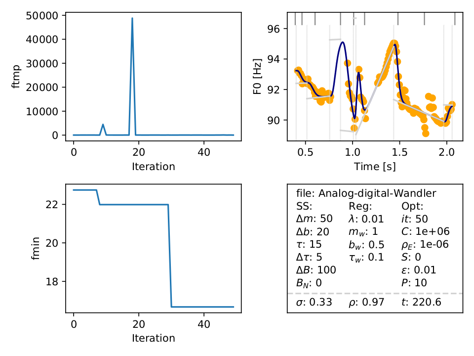
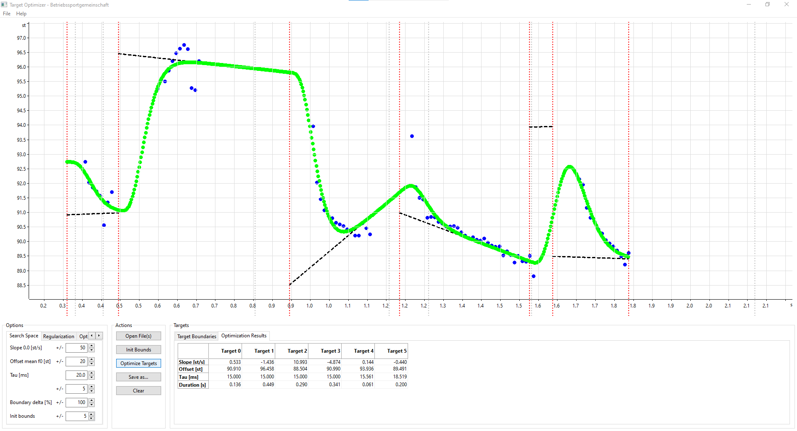

# TargetOptimizer Benchmarks
Required: python 3.x, pandas, numpy, matplotlib

You can test the TO cmd functionality by running:

``python TO_Benchmark.py --test``

This will run the TO on the utterance 'Analog-Digital-Wandler' three times: 
1. Standard settings without boundary optimization.
2. Standard settings with boundary optimization.
3. Standard settings with boundary optimization but with uniform boundary initialization instead of the TextGrid.

The output LOG files are saved to the ./LOG directory (will be created automatically if it does not exist).

Running:

``python TO_benchmarks.py --demo``

will plot the results from an example LOG file (LOG_Example.csv), and the plot will look like this:

This demonstrates that all variable states saved in the log file, can be reloaded successfully.
If you want to produce the same plot with an arbitrary LOG file run:

``python TO_benchmarks.py --demo path_to_LOG_file``

(See doc folder for further examples)
## Further tests
If you want to make a test with custom parameters, the easiest way would be to modify the "eval_test()" function in the "TO_Benchmarks()" class to pass the custom parameters to the "run()" function.

## Hyperparameter evaluation

The command 

``python TO_benchmarks.py --hyper``

is meant to run on a high performance cluster, as it performs a two dimensional hyper parameter search over the maxCostEvaluations-rhoEnd array, with 40 search options. This gives a total 40 (hyper parameter options) x 3 (no boundary opt, boundary opt, boundary init) x 8 (example utterances) x 1000 (maxIterations) = 960.000 TO iterations.

The command was of course not tested locally, however a smaller version of the same function (using maxiterations = 1, instead of 1000) was tested successfully. Therefore the hyper parameter evaluation should work (although I would not bet money on it).

# TargetOptimizer
TargetOptimizer is a free and open-source PC software in C++ originally written by Patrick Schmager to estimate pitch targets according to the Target Approximation Model by Yi Xu. 

Hence, it is similar to PENTAtrainer, but differs in the following ways:
- A 5th-order linear system is uses as the filter to approximate the targets instead of a 3rd-order system.
- The target parameters are jointly optimized instead of for one target after another.
- The optimization includes a regularization term to penalize extreme target parameters, e.g., extreme positive or negative target slopes or time constants.
- The estimated targets can be written to a gestural score file for VocalTractLab. This simplifies the copy-synthesis of natural utterances using the articulatory speech synthesizer.

The motivation for these differences are described in Birkholz P, Schmager P, Xu Y (2018). Estimation of Pitch Targets from Speech Signals by Joint Regularized Optimization. In: Proc. of the 26th European Signal Processing Conference (EUSIPCO 2018), pp. 2089-2093, Rome, Italy. [pdf](http://www.vocaltractlab.de/publications/birkholz-2018-eusipco.pdf)

To estimate the pitch targets for an utterance, the model needs as input the syllable boundaries in terms of a Praat TextGrid file, and the pitch contour in terms of a Praat PitchTier file. Based on these data, the pitch targets can be estimated and exported in terms of a CSV file, a gestural score for VocalTractLab, or as a Praat PitchTier file with the model f0 contour. The software can be executed as a command line tool (without a GUI, to support batch processing) or as an application with a GUI. To call the program with GUI, simply start it without any parameters. A screenshot of the GUI is shown below (for the German word "Ästhetik").

## Build for Windows using Visual Studio 2019+
Simply open the solution TargetOptimizer.sln and build.

## Build for Linux using GCC:

Navigate inside the Sources folder and run one of the following commands.

For the GUI version (requires wxWidgets):

``g++ -std=c++14 -O3 -D USE_WXWIDGETS -I.. ../dlib/all/source.cpp -fopenmp -fpermissive -lpthread -lX11 *.cpp `wx-config --cxxflags --libs std` -o TargetOptimizer``

For the command-line-only version:
``g++ -std=c++14 -O3 -I.. ../dlib/all/source.cpp -fopenmp -lpthread -lX11 *.cpp -o TargetOptimizer``

Run TargetOptimizer from the command line:
Run TargetOptimizer -h for instructions.
